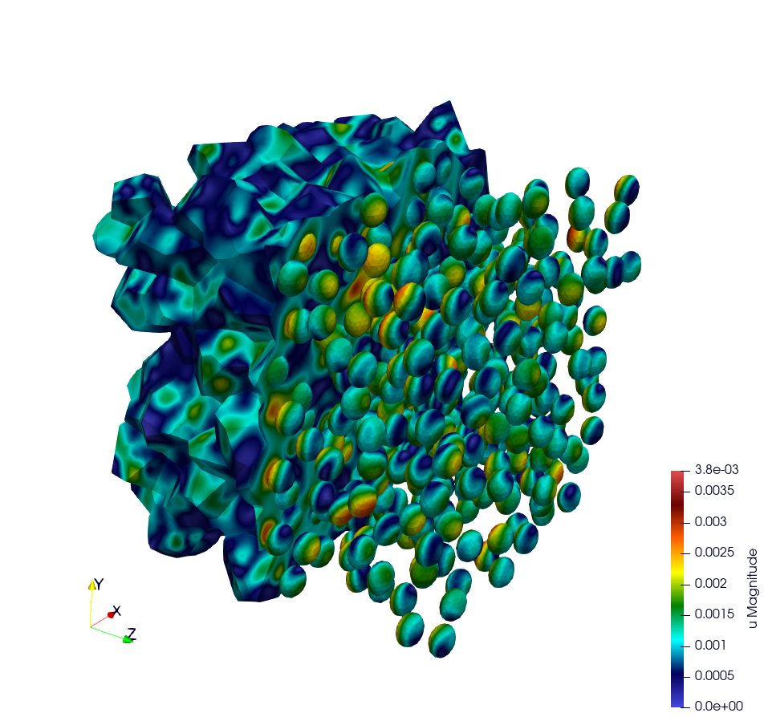

# How to run the simulation "RVE MOX"


## Problem solved




```
    Problem : Rve mox2 phases with an elasto-viscoplastic behavior law

    Parameters : 

    start time = 0
    end time = 5s
    number of time step = 40

    Strain Gradient matrix : val = 0.012
    [ - val / 2 ,         0 ,   0 ]
    [ 0         , - val / 2 ,   0 ] 
    [ 0         ,          0, val ]
    
    Solver : HyprePCG
    Preconditionner : HypreBoomerAMG

    Behavior law parameters : ImplicitNortonThreshold
    [ parameters       , matrix   , inclusions ]    
    [ Young Modulus    , 8.182e9  , 2*8.182e9  ];
    [ Poisson Ratio    , 0.364    , 0.364      ];
    [ Stress Threshold , 100.0e6  , 100.0e12   ];
    [ Norton Exponent  , 3.333333 , 3.333333   ];
    [ Temperature      , 293.15   , 293.15     ];

    Element :

    Familly H1
    Order 2
```

## How to build the mesh

The mesh is generated with MEROPE and GMSH through the following steps:
- First step, use MEROPE to generate a `.geo` file using the RSA algorithm. Scripts are in directory `script_merope`. 
- Second step, use GMSH to mesh the geometry. Files `.geo` are in the directory `file_geo`.

Command lines:

```
python3 script_17percent_minimal.py
gmsh -3 OneSphere.geo 
```

## Run the simulation

## Options:

Command line | Descritption 
---|---
--mesh or -m | specify the mesh ".msh" usedn default = inclusion.msh
--refinement or -r | refinement level of the mesh, default = 0
--order or -o | Finite element order (polynomial degree), default = 2
--verbosity-level or -v | choose the verbosity level, default = 0
--post-processing or -p | run post processing step, default = 1

### Run the minimal version of this example

```
./mox2 -o 3 --mesh OneSphere.msh
mpirun -n 12 ./mox2 -o 1 --mesh 634Spheres.msh
```

### CCRT/Topaze

```
ccc_mprun -n 8 -c 1 -p milan ./mox2 -r 0 -o 3 --mesh OneSphere.msh
ccc_mprun -n 2048 -c 1 -p milan ./mox2 -r 2 -o 1 --mesh 634Sphere.msh
```

## Display results

Comparison by seeing the value of SZZ in function of the time.

### Extract data

```
awk '{if(NR>13) print $1 " " 0.83*$4+0.17*$10}' avgStress > res-mfem-mgis.txt
```

Reference values can be found in the directory `results`, file res-fft.txt. Experimental values are available: `results/res-mfem-mgis-onesphere-o3.txt` and `results/res-mfem-mgis-634sphere-o2.txt`.

### Display results with gnuplot

```
plot "res-fft.txt" u 1:10 w l title "fft"
gnuplot> replot "res-mfem-mgis-onesphere-o3.txt" u 1:2 w l title "mfem-mgis"
```

## Illusations 

Illustrations are available in the directory `gif`
