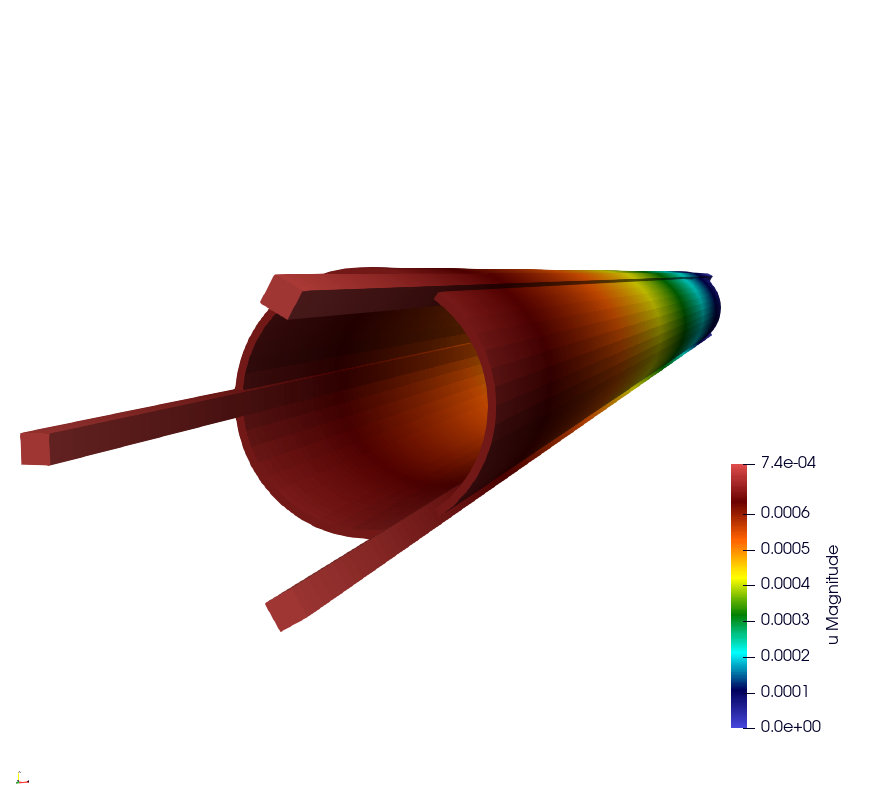

# Thermomechanical Simulation with MFEM-MGIS

## Project Overview

This project implements a nonlinear thermomechanical coupling solver based on the **MFEM-MGIS** library. It is designed to simulate the complex behavior of materials (such as **U3Si2** fuel and **ALFENI** cladding) subjected to intense thermal and mechanical loads.

The code manages a strong coupling (via an `IterativeCouplingScheme`) between two physics:
1. **Heat Transfer:** Resolution of the heat equation, taking into account a time-varying power source term.
2. **Mechanics:** Resolution of the mechanical equilibrium integrating complex behaviors generated via **MFront** (thermal expansion, solid swelling, Norton PRQ viscoplasticity, and plasticity with hardening).

The code is optimized for parallel computing (MPI) and allows the use of advanced iterative solvers (Hypre family) or direct solvers depending on the physics involved.

---

## Prerequisites and Installation

To compile and run this project, you need the **MFEM-MGIS** environment, which relies on **MFEM** (finite elements) and **TFEL/MGIS** (integration of MFront material behaviors).

### Main Dependencies
* **MPI** (OpenMPI, MPICH, etc.) for parallel computing.
* **TFEL/MFront** (compiled with generic interfaces).
* **MFEM** (compiled with MPI, Hypre, and ideally Metis support).
* **MGIS** (MFront Generic Interface Support).

### Installation Guide
To install the library and its dependencies, please refer to the official documentation:
**[MFEM-MGIS Installation Guide](https://thelfer.github.io/mfem-mgis/installation_guide/installation_guide.html)**

Once the environment is set up, you can compile this thermomechanical project by linking your `CMakeLists.txt` to the `mfem-mgis` installation.

---

## Mesh Generation

The default mesh (`mesh/assemblage_hexa.msh`) is generated from the `mesh/assemblage_hexa.py` **gmsh** script. It is copied next to the executable at build time, so regenerating it is only needed when the geometry or mesh density changes.

The script requires the `gmsh` Python module. If it is not installed (e.g. via `pip install gmsh`), point `PYTHONPATH` to a local gmsh SDK instead:

```bash
export PYTHONPATH=path/gmsh-4.11.1-Linux64-sdk/lib/
```

Then generate the mesh with:

```bash
cd mesh
python3 assemblage_hexa.py --output_file assemblage_hexa.msh
```

Available options (all optional, with defaults):

| Option | Description |
| :--- | :--- |
| `--densHaut` | Number of elements along the height (default: `10`). |
| `--densFuelLength` | Number of elements along the fuel length (default: `15`). |
| `--densFuelThick` | Number of elements across the fuel thickness (default: `5`). |
| `--densCladConn` | Number of elements across the cladding thickness (default: `5`). |
| `--densStifThick` | Number of elements across the stiffener thickness (default: `5`). |
| `--densStifConn` | Number of elements in the stiffener outside the cladding (default: `5`). |
| `--output_file` | Path to the output mesh file (default: `assemblage_hexa.msh`). |

---

## Usage and Command-Line Arguments

The main program accepts several command-line arguments to configure the mesh, MFront behaviors, and linear solvers. 

Here is a summary table of the available options:

| Short Option | Long Option | Description |
| :--- | :--- | :--- |
| `-m` | `--mesh` | Path to the mesh file (e.g., `.msh`, `.vtk`). |
| `-lU` | `--libraryU3SI2` | Path to the compiled MFront library (`.so`) for the U3Si2 material. |
| `-lA` | `--libraryALFENI` | Path to the compiled MFront library (`.so`) for the ALFENI material. |
| `-svTh` | `--solverTh` | Name of the linear solver to use for the heat transfer problem: an iterative solver (e.g., `HypreGMRES`) or a direct solver (`MUMPSSolver`, `UMFPackSolver`). |
| `-pcTh` | `--preconditionnerTh` | Preconditioner associated with the thermal solver (e.g., `HypreBoomerAMG`), ignored for direct solvers. |
| `-svMc` | `--solverMc` | Name of the linear solver to use for the mechanics problem: an iterative solver (e.g., `HyprePCG`) or a direct solver (`MUMPSSolver`, `UMFPackSolver`). |
| `-pcMc` | `--preconditionnerMc` | Preconditioner associated with the mechanics solver. |
| `-o` | `--order` | Finite element order (polynomial degree, default is usually 1). |
| `-r` | `--refinement` | Uniform refinement level of the mesh (default: `0`). |
| `-p` | `--post-processing` | Enables (`1`) or disables (`0`) the export of results for ParaView. |
| `-v` | `--verbosity-level` | Verbosity level of the console logs (`0` = minimal, higher levels = increased details). |
| `-dur` | `--duree` | Total simulation duration (default: `1e5`). |
| `-ns` | `--nbsteps` | Number of time steps (default: `1`). |
| `-hc` | `--h-conv` | Thermal convection coefficient (default: `5e4`). |

### Parallel Execution Example

```bash
mpirun -np 4 ./Thermomechanical \
  -m assemblage_hexa.msh \
  -lU src/libU3SI2-generic.so \
  -lA src/libALFENI-generic.so \
  -svTh HypreGMRES -pcTh HypreBoomerAMG \
  -svMc HyprePCG -pcMc HypreBoomerAMG \
  -o 1 -r 0 -p 1 -v 1 \
  -dur 1e5 -ns 1 -hc 5e4
```

### Direct Solver Example (MUMPS)

```bash
mpirun -np 1 ./Thermomechanical \
  -m assemblage_hexa.msh \
  -lU src/libU3SI2-generic.so \
  -lA src/libALFENI-generic.so \
  -svTh HypreGMRES -pcTh HypreBoomerAMG \
  -svMc MUMPSSolver \
  -o 1 -r 0 -p 1 -v 0 \
  -dur 1e5 -ns 1 -hc 5e4
```

This configuration is also registered as the `Thermomechanical_MUMPS` CTest test.

Resulting mechanical displacement field (`u Magnitude`) obtained with this test case, visualized with ParaView:

```bash
paraview Results/Mechanics/Mechanics.pvd
```

