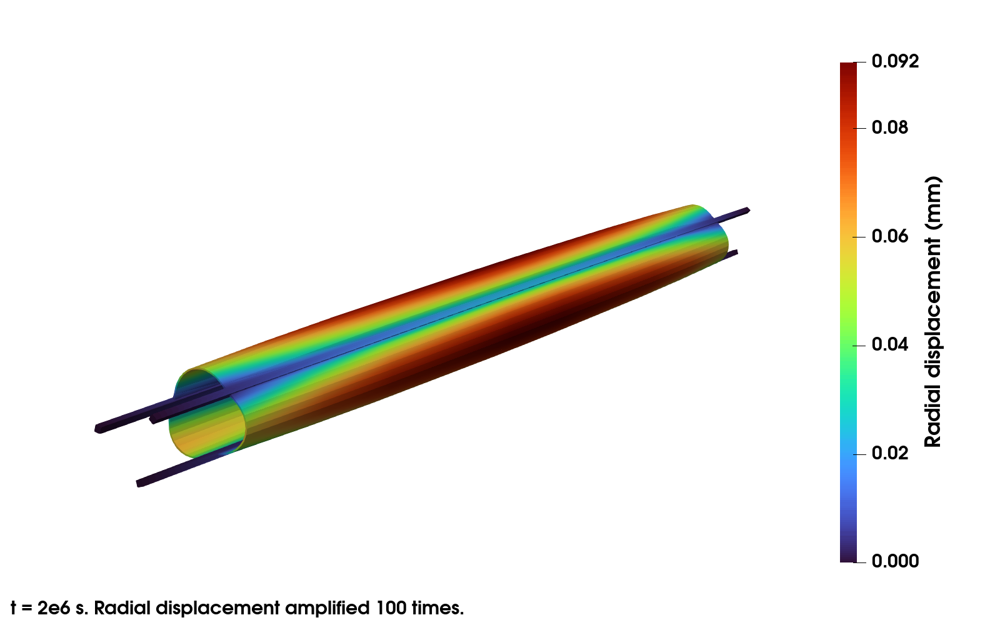

# Thermomechanical Simulation with MFEM-MGIS

## Project Overview

This project implements a nonlinear thermomechanical coupling solver based on the **MFEM-MGIS** library. It is designed to simulate the complex behavior of materials (such as **U3Si2** fuel and **ALFENI** cladding) subjected to intense thermal and mechanical loads.

The code manages a strong coupling (via an `IterativeCouplingScheme`) between two physics:
1. **Heat Transfer:** Resolution of the heat equation, taking into account a time-varying power source term.
2. **Mechanics:** Resolution of the mechanical equilibrium integrating complex behaviors generated via **MFront** (thermal expansion, solid swelling, Norton PRQ viscoplasticity, and plasticity with hardening).

The code is optimized for parallel computing (MPI) and allows the use of advanced iterative solvers (Hypre family) or direct solvers depending on the physics involved.

---

## Prerequisites and Installation

To compile and run this project, you need the **MFEM-MGIS** environment, which relies on **MFEM** (finite elements) and **TFEL/MGIS** (integration of MFront material behaviors).

### Main Dependencies
* **MPI** (OpenMPI, MPICH, etc.) for parallel computing.
* **TFEL/MFront** (compiled with generic interfaces).
* **MFEM** (compiled with MPI, Hypre, and ideally Metis support).
* **MGIS** (MFront Generic Interface Support).

### Installation Guide
To install the library and its dependencies, please refer to the official documentation:
**[MFEM-MGIS Installation Guide](https://thelfer.github.io/mfem-mgis/installation_guide/installation_guide.html)**

Once the environment is set up, you can compile this thermomechanical project by linking your `CMakeLists.txt` to the `mfem-mgis` installation.

---

## Mesh Generation

The default mesh (`mesh/assemblage_hexa.msh`) is generated from the `mesh/assemblage_hexa.py` **gmsh** script. It is copied next to the executable at build time, so regenerating it is only needed when the geometry or mesh density changes.

The script requires the `gmsh` Python module. If it is not installed (e.g. via `pip install gmsh`), point `PYTHONPATH` to a local gmsh SDK instead:

```bash
export PYTHONPATH=path/gmsh-4.11.1-Linux64-sdk/lib/
```

Then generate the mesh with:

```bash
cd mesh
python3 assemblage_hexa.py --output_file assemblage_hexa.msh
```

The coarser mesh `mesh/assemblage_hexa_coarse.msh`, used by the tests in the debug and coverage builds, is generated with:

```bash
python3 assemblage_hexa.py --densHaut 5 --densFuelLength 8 --densFuelThick 3 --densCladConn 3 --densStifThick 3 --densStifConn 3 --output_file assemblage_hexa_coarse.msh
```

Available options (all optional, with defaults):

| Option | Description |
| :--- | :--- |
| `--densHaut` | Number of elements along the height (default: `10`). |
| `--densFuelLength` | Number of elements along the fuel length (default: `15`). |
| `--densFuelThick` | Number of elements across the fuel thickness (default: `5`). |
| `--densCladConn` | Number of elements across the cladding thickness (default: `5`). |
| `--densStifThick` | Number of elements across the stiffener thickness (default: `5`). |
| `--densStifConn` | Number of elements in the stiffener outside the cladding (default: `5`). |
| `--output_file` | Path to the output mesh file (default: `assemblage_hexa.msh`). |

---

## Usage and Command-Line Arguments

The main program accepts several command-line arguments to configure the mesh, MFront behaviors, and linear solvers. 

Here is a summary table of the available options:

| Short Option | Long Option | Description |
| :--- | :--- | :--- |
| `-m` | `--mesh` | Path to the mesh file (default: `assemblage_hexa.msh`). |
| `-lU` | `--libraryU3SI2` | Path to the compiled MFront library (`.so`) for the U3Si2 material (default: `src/libU3SI2-generic.so`). |
| `-lA` | `--libraryALFENI` | Path to the compiled MFront library (`.so`) for the ALFENI material (default: `src/libALFENI-generic.so`). |
| `-lsTh` | `--linearsolver-thermal` | Name of the linear solver to use for the heat transfer problem: an iterative solver (default: `HypreGMRES`) or the direct solver `MUMPSSolver`. |
| `-pcTh` | `--preconditioner-thermal` | Preconditioner associated with the thermal solver (default: `HypreBoomerAMG`), ignored for direct solvers. |
| `-lsMc` | `--linearsolver-mechanics` | Name of the linear solver to use for the mechanics problem: the direct solver `MUMPSSolver` (default) or an iterative solver (e.g., `HyprePCG`). |
| `-pcMc` | `--preconditioner-mechanics` | Preconditioner associated with the mechanics solver (default: `HypreBoomerAMG`), ignored for direct solvers. |
| `-o` | `--order` | Finite element order (polynomial degree, default: `1`). |
| `-r` | `--refinement` | Uniform refinement level of the mesh (default: `0`). |
| `-pp`, `-no-pp` | `--post-processing`, `--no-post-processing` | Enables (default) or disables the export of results for ParaView. |
| `-v` | `--verbosity-level` | Verbosity level of the linear solvers (default: `0`). |
| `-d`, `-no-d` | `--debug`, `--no-debug` | Prints (default) or not the minimum, maximum and mean values of the temperature, of the norm of the displacement, of the swelling and of the power density at the end of the simulation. |
| `-rf` | `--reference-file` | File of reference values of these statistics, one line per field, in the printed format (default: no comparison). |
| `-et` | `--end-time` | End time of the simulation (default: `1e5`). |
| `-ns` | `--nbsteps` | Number of time steps (default: `1`). |
| `-tr` | `--t-ramp` | Duration of the power ramp (default: `1e5`). Its end must be a time step boundary, otherwise the run stops. `0` disables the ramp. |
| `-hc` | `--h-conv` | Thermal convection coefficient (default: `5e4`). |
| `-wp` | `--water-pressure` | Coolant pressure applied on the cladding and the stiffeners (default: `1e6`). |

At the end of the simulation, the swelling is compared to its exact value: since the end of the power ramp is a time step boundary, the power density is linear over each time step and the swelling model integrates it exactly. The run fails if they differ.

### Parallel Execution Example

```bash
mpirun -np 4 ./rjh_plate \
  -m assemblage_hexa.msh \
  -lsTh HypreGMRES -pcTh HypreBoomerAMG \
  -lsMc MUMPSSolver \
  -o 1 -r 0 -v 0 \
  -et 1e5 -ns 1 -hc 5e4
```

Iterative solvers are much slower than MUMPS for the mechanics of this problem. With the default mesh, the simulation takes 8 s on 2 processes with MUMPS, about 2 minutes on 2 processes with `CGSolver` or `MINRESSolver` preconditioned by `HypreBoomerAMG`, and 165 s on 4 processes with `HyprePCG`. `GMRESSolver`, `SLISolver` and `BiCGSTABSolver` did not converge within 5 minutes.

The results are exported for ParaView:

```bash
paraview Results/Mechanics/Mechanics.pvd
```

The figures show the results at t = 2e6 s. They are computed with `mpirun -n 4 ./Thermomechanical -et 2e6 -ns 20`. The radial displacement is amplified 100 times. The cladding bulges between the stiffeners.




## Tests

Three tests are run by `ctest`:

- `rjh_plate` runs the simulation on 2 processes with the default mesh and compares the statistics of the temperature and of the displacement to the reference values of `assemblage_hexa-statistics.ref`. In the debug and coverage builds, which are much slower, it uses the coarser mesh `assemblage_hexa_coarse.msh` and the reference values of `assemblage_hexa_coarse-statistics.ref`;
- `u3si2_swelling` compares the swelling model to its exact value under a power ramp (`mtest/Swelling.mtest`);
- `robin_test` compares the Robin boundary condition to the exact solution of a bar (see `Robin/README.md`).
