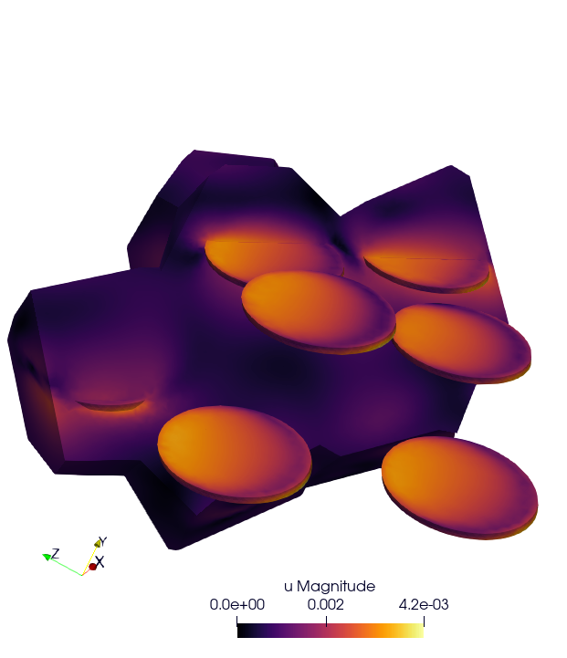

# CERMET SIMULATION

## Description

TODO : ADD Description




## From Merope To MESH

First, use the merope script : `script/script_merope.py`. 

```
source Env_Merope.sh
python3 script_merope.py
```

This script creates a file `cermet.geo`, now we convert it to mfem msh (cermet.msh). Note that the mfem format and the meshSize are specified at the end of the file `cermet.geo`.

```
gmsh -3 cermet.geo
```


## Run Your Simulation

### Basic command

```
mpirun -n 4 ./cermet_elasticity --mesh cermet.msh --verbosity-level 0 
```

### Simulation Parameters

```
Usage: ./cermet_elasticity [options] ...
Options:
   -h, --help
	Print this help message and exit.
   -m <string>, --mesh <string>, current value: cermet.mesh
	Mesh file to use.
   -l <string>, --library <string>, current value: src/libBehaviour.so
	Material library.
   -o <int>, --order <int>, current value: 1
	Finite element order (polynomial degree).
   -r <int>, --refinement <int>, current value: 0
	refinement level of the mesh, default = 0
   -pp <int>, --post-processing <int>, current value: 1
	run post processing step
   -v <int>, --verbosity-level <int>, current value: 1
	choose the verbosity level
```
